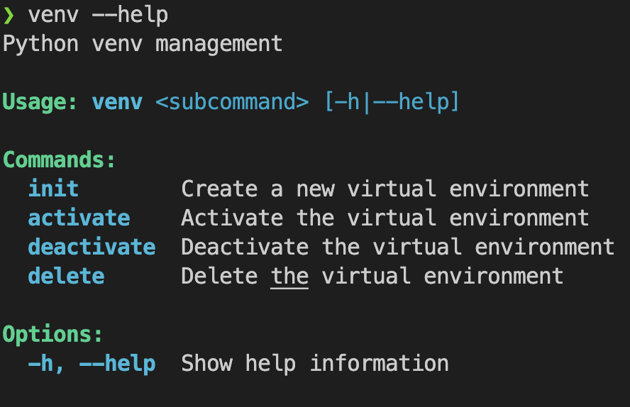
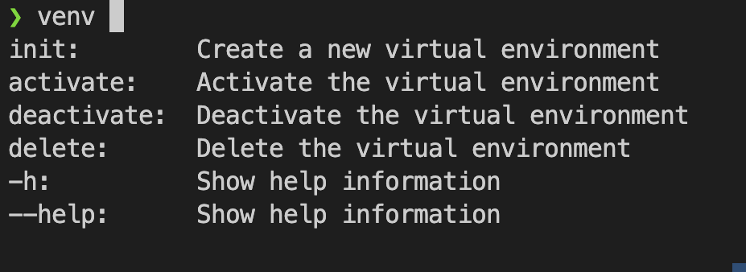

# Eashy

**No more hassle writing shell functions! Easy subcommands and help documentation**

Eashy is a command-line tool that generates shell functions with subcommands and integrated help documentation from simple KDL configuration files. Say goodbye to manually writing complex shell functions and hello to declarative command definitions!

## Features

- 🚀 **Simple KDL syntax**: Define commands using the human-friendly KDL format
- 👑 **Nested subcommands**: Support for multiple levels of command hierarchies
- 📖 **Automatic help generation**: Built-in `--help` support for all commands and subcommands
- 🎨 **Beautiful output**: Colorized help text and command output
- ⚡ **Shell function generation**: Automatically generates optimized shell functions
- 🔧 **Auto complete**: Built-in support for autocomplete for bash/zsh
## Table of Contents


- [Eashy](#eashy)
  - [Features](#features)
  - [Table of Contents](#table-of-contents)
  - [Installation](#installation)
  - [Quick Start](#quick-start)
  - [KDL Syntax](#kdl-syntax)
    - [Basic Command Structure](#basic-command-structure)
    - [Arguments](#arguments)
      - [Optional values quirks](#optional-values-quirks)
      - [Variable argument count](#variable-argument-count)
    - [Nested Subcommands with description](#nested-subcommands-with-description)
    - [Command Prefixes](#command-prefixes)
  - [Use Cases](#use-cases)
    - [Development Workflows](#development-workflows)
    - [Environment Management](#environment-management)
    - [Git Workflows](#git-workflows)
  - [Why Eashy?](#why-eashy)
  - [Contributing](#contributing)
  - [License](#license)
  - [Links](#links)


## Installation

For Linux or MacOS:
```bash
curl -fsSL https://github.com/jilchab/eashy/raw/main/install.sh | sh
```

Or using Cargo:
```bash
cargo install eashy
```

## Quick Start

1. Create a KDL file defining your commands (or use the `default.kdl`):

```kdl
("Python venv management") \
venv {
    ("Create a new virtual environment") \
    init {
        python -m venv ".venv"
        source ".venv/bin/activate"
        echo "Activated virtual environment, version: $(python --version)"
    }

    ("Activate the virtual environment") \
    activate {
        source ".venv/bin/activate" && \
        echo "Activated virtual environment, version: $(python --version)" || \
        echo "Failed to activate virtual environment. Make sure .venv exists."
    }

    ("Deactivate the virtual environment") \
    deactivate {
        deactivate && echo "Deactivated virtual environment"
    }
    ("Delete the virtual environment") \
    delete {
        deactivate
        rm -rf ".venv" && \
        echo "Removed virtual environment"
    }
}
```

2. Generate shell functions:

Generate the shell script for every functions contained in the kdl file

```bash
eashy
```
_Note: You can change the input/output files, try `eashy --help` for more info_

3. Source the generated script:

```bash
source ~/.eashy/eashy.sh
```
Add this line to your ~/.bashrc or ~/.zshrc!

4. Use your new commands with automatic help:

```bash
venv --help           # Shows main command help
venv init --help      # Shows subcommand help
venv init             # Creates and activates virtual environment
```

What the help section looks like:



And cherry on top, you get autocompletion with all your commands on bash/zsh:



Every time you update your kdl file, dont forget to regenerated the shell file with the eashy command!
## KDL Syntax

Here is a quick introduction, more examples in example.kdl

### Basic Command Structure

```kdl
my_cmd {
    shell_command arg1 arg2
    another_command "with" "arguments"
}
```

Basically, each node without children are interpreted as s shell line to be executed, and parents node are commands/subcommands

### Arguments
Next to a command, you can ask for positional and optional arguments.
- **Positional arguments**: Default KDL argument, the order is important.
- **Optional arguments**: Also called options or flags, they can be used using KDL properties. The indentifier is now the argument name, and its value the default value.

Arguments can be used in shell commands using **$**
```kdl
new_sh_file filename shebang="#!/bin/sh" {
    "filename=${filename%.*}.sh"    // Make sure the name ends with .sh (Quotes for escaping '{' and '}' characters)
    echo $shebang > $filename       // Create the file and write the shebang
    chmod +x $filename              // Make the file executable
}
```

#### Optional values quirks

- They starts with `--` or `-` if its name is one character
- Optional flags require values, except boolean flags
- Even when not set, they can still be used with their default value
- Default values can be a string, a number or #true/#false for boolean flags.
- Description is put after the equal sign (See the [ "Description"](#nested-subcommands-with-description) chapter)

 Example:
  ```kdl
  create_file name="file.txt" v=#false verbose=#false {
    touch $name
    if $v || $verbose; then
        echo "New file $name created"
    fi
  }
  ```

```sh
$ create_file --name hello.rs -v
New file hello.rs created
```


#### Variable argument count
Some arguments can accept more than one string

You can prefix arguments with:
- `*arg`: Zero or more arguments needed
- `+arg`: One or more arguments needed
- `?arg`: Zero or one argument needed

For example, a command that iterate each source and copy to a destination with a message.
```kdl
mycopy +src dest {
    for s in $src; do
        echo "copy $s to $dest"
        cp $s $dest
    done
}
```
In this example, the for loop syntax is similar in bourne-like shell, as a node without children can be terminated by a semicolon

### Nested Subcommands with description

```kdl
("Main command description") \
main_command {
    ("Subcommand description") \
    sub_command ("Arg help section")arg {
        echo "This is a subcommand with one arg: $arg"
    }

    ("Another subcommand") \
    another_sub find=("Help for optional args too, default empty")"" {
        ls "-la" | grep "$find"
    }
}
```

See the help section with:
```sh
main_command --help
main_command sub_command -h
...
```

### Command Prefixes

Eashy supports special prefixes for flow control:

- `command_name`  - **Execute All**: Run all commands regardless of success/failure
- `&command_name` - **Until Error**: Stop execution if one command fails
- `|command_name` - **Until Success**: Stop execution if one command succeeds

Example:

```kdl
&stop_on_error {
    echo "This command has a & prefix"
    "false"
    echo "This will not run as the previous command fails"
}

|stop_on_success {
    "false"
    echo "This command has a | prefix"
    echo "This will not run as the previous command succeeds"
}
```

## Use Cases

### Development Workflows

Perfect for creating project-specific command shortcuts:

```kdl
("Development commands") \
dev {
    ("Start development server") \
    start {
        npm run dev
    }

    ("Run tests") \
    test {
        npm run test
    }

    ("Build for production") \
    build {
        npm run build
    }
}
```

### Environment Management

Simplify environment setup and management:

```kdl
("Docker operations") \
dck {
    ("Start all services") \
    up {
        docker-compose up -d
    }

    ("Stop all services") \
    down {
        docker-compose down
    }

    ("View logs") \
    logs {
        docker-compose logs -f
    }
}
```

### Git Workflows

Create custom git command combinations:

```kdl
("Git workflow shortcuts") \
git-flow {
    ("Quick commit and push") \
    qcp m=("Commit message")"Quick commit"{
        git add "."
        git commit -m $m
        git push
    }

    ("Create and switch to new branch") \
    new-branch name {
        git checkout -b $name
        git push -u origin
    }
}
```

## Why Eashy?

- **Declarative**: Define what you want, not how to implement it
- **Maintainable**: Easy to modify and extend command definitions
- **Consistent**: Standardized help format across all commands
- **Efficient**: Generates optimized shell code
- **Portable**: Works with any POSIX-compliant shell

## Contributing

Contributions are welcome! Please feel free to open an issue or submit a pull request.

## License

This project is licensed under the Apache-2.0 License - see the [LICENSE](LICENSE) file for details.

## Links
- [KDL Language](https://kdl.dev/) - Learn more about the KDL format
- [Crates.io](https://crates.io/crates/eashy)
- [Repository](https://github.com/jilchab/eashy)
